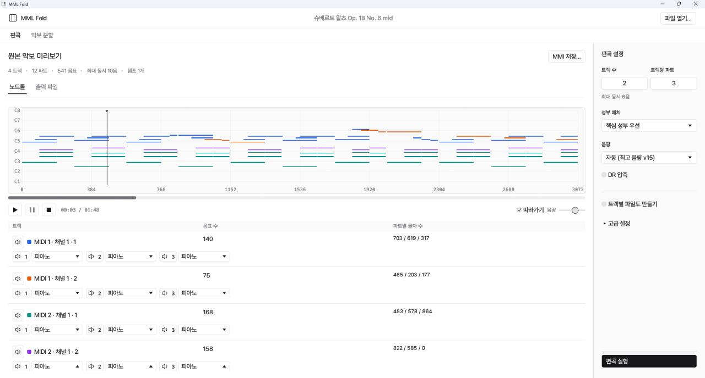
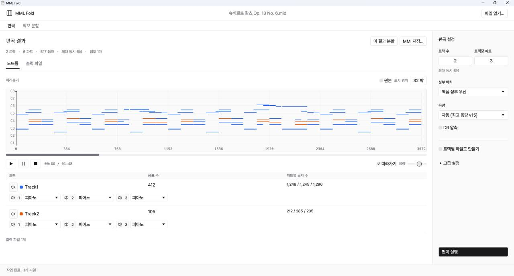
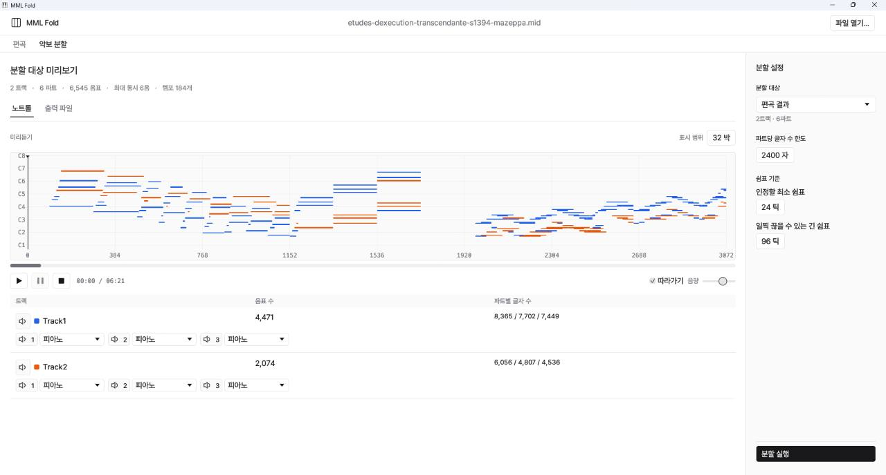
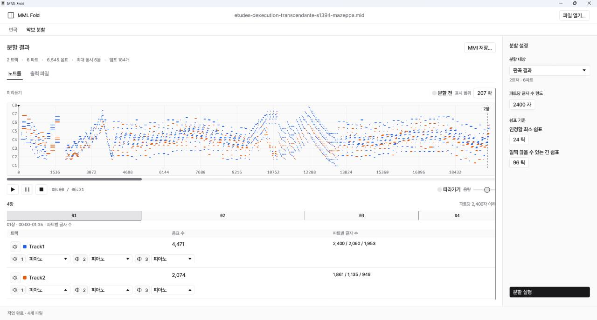

# MML 세단기

MIDI·MMI 악보를 원하는 성부 수로 편곡하고, 긴 악보를 나눠 MMI로 저장합니다.

**[다운로드](https://github.com/teatray-top/MML-Shredder/releases/tag/v0.1.0)**

## 악보 열고 편곡하기

**편곡 전**

**편곡 후**

1. **파일 열기…** 또는 드래그로 `.mid`, `.midi`, `.mmi` 파일 열기
2. 오른쪽 **트랙 수**와 **트랙당 파트**를 선택할 수 있습니다.
3. **편곡 실행**을 눌러 설정한 트랙×파트로 압축

편곡한 트랙을 각각 별도 파일로도 저장하려면 **편곡 실행** 전에 **트랙별 파일도 만들기**를 선택

- 트랙 옆 스피커는 트랙 전체를, 아래 번호 옆 스피커는 해당 파트만 켜고 끕니다.
- 피아노·하프·실로폰 등 17종의 가상악기로 재생할 수 있습니다.
- **DR 압축**을 켜고 음량 범위를 조절합니다.  
  `11–15`로 설정하면 음량이 11~15사이에어 정규화 됩니다.

| 조작 | 동작 |
|---|---|
| Ctrl + 휠 | 악보 확대·축소 |
| Shift + 휠 | 좌우 이동 |
| Space | 재생·일시정지 |
| 따라가기 | 재생 위치를 따라 화면 이동 |

## 긴 악보 나누고 저장하기

**분할 전**

**분할 후**

1. **이 결과 분할**을 누르거나 **악보 분할** 탭으로 이동합니다.
2. **분할 대상**을 확인하고 **분할 실행**을 누릅니다. 모든 트랙을 같은 시점에서 잘라 각 파트를 기본 2,400자 이내로 분할합니다.
3. 아래의 장 번호를 눌러 구간과 글자 수를 확인합니다.
4. **MMI 저장**을 누르고 저장할 폴더를 고릅니다. 분할한 각 장이 `.mmi` 파일로 저장됩니다.
5. # 저장된 MMI를 마비꼬로 열어서 내보내기 후 악보에 붙여넣어주세요.
---

[MIT 라이선스](LICENSE) · [VST음원·글꼴 라이선스](THIRD_PARTY.md)
